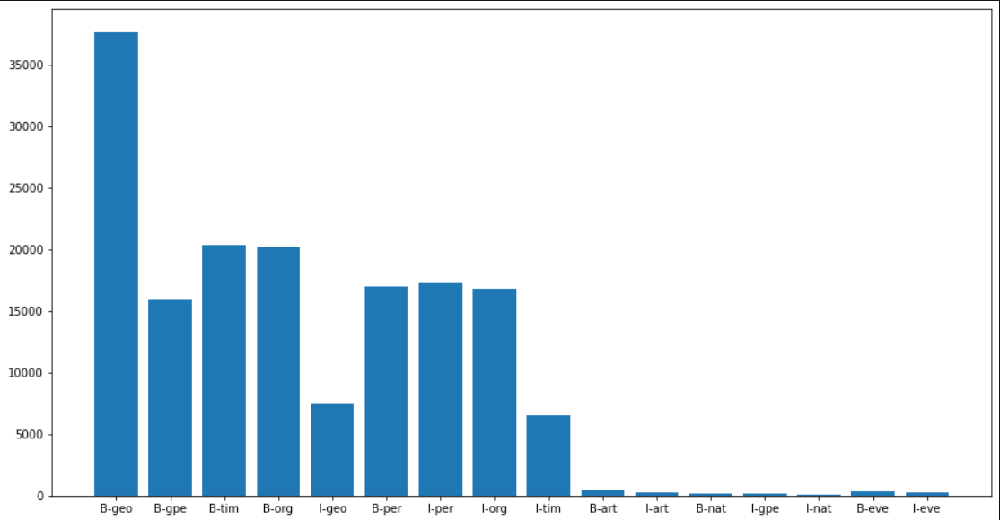
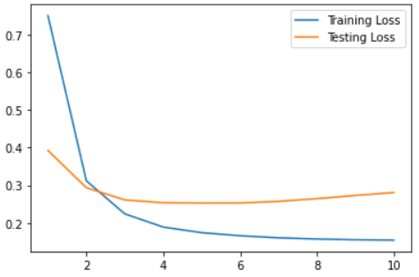

# Named Entity Recognition

Named-entity recognition (NER) (also known as (named) entity identification, entity chunking, and entity extraction) is a subtask of information extraction that seeks to locate and classify named entities mentioned in unstructured text into pre-defined categories such as person names, organizations, locations, medical codes, time expressions, quantities, monetary values, percentages, etc.

## Tagging system in dataset
The IOB Tagging system contains tags of the form:

- **B** - {CHUNK_TYPE} – for the word in the Beginning chunk
- **I** - {CHUNK_TYPE} – for words Inside the chunk
- **O** – Outside any chunk

The IOB tags are further classified into the following classes –

- **geo** = Geographical Entity
- **org** = Organization
- **per** = Person
- **gpe** = Geopolitical Entity
- **tim** = Time indicator
- **art** = Artifact
- **eve** = Event
- **nat** = Natural Phenomenon

The tag distribution is dataset can be seen in the below graph.

## Model
I have trained a simple LSTM network using Word embedding layer. The Loss and Accuracy curves are as follows,

Loss Curve : 

Accuracy Curve : 

I have obtained a best accuracy of `94.77 %`.

# References
- deeplearning.ai, NLP Specialization - https://www.coursera.org/learn/sequence-models-in-nlp/home/welcome